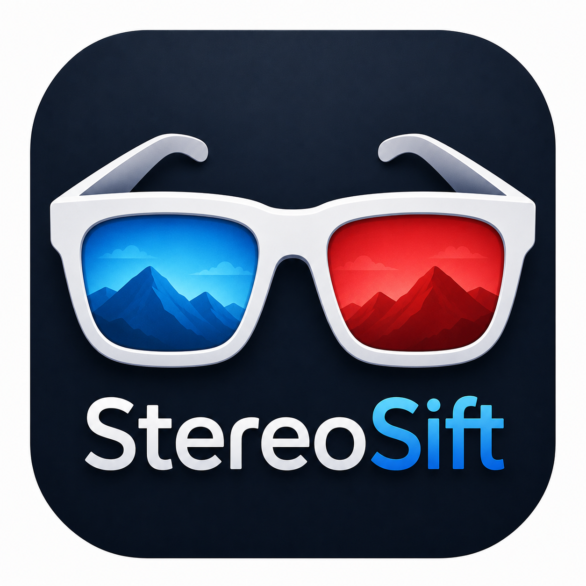
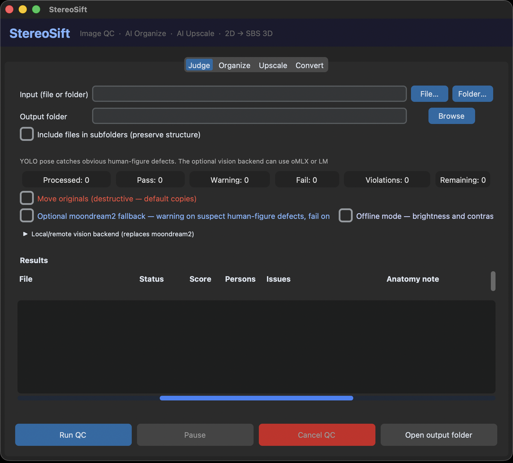
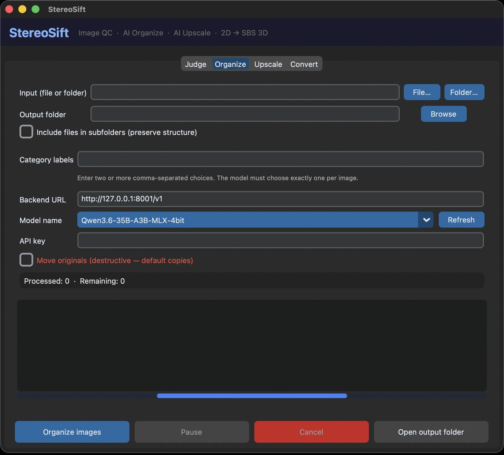
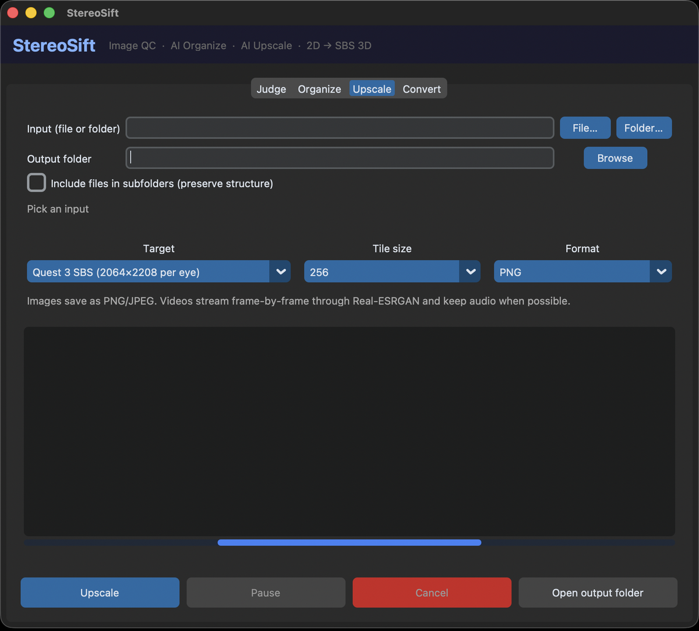
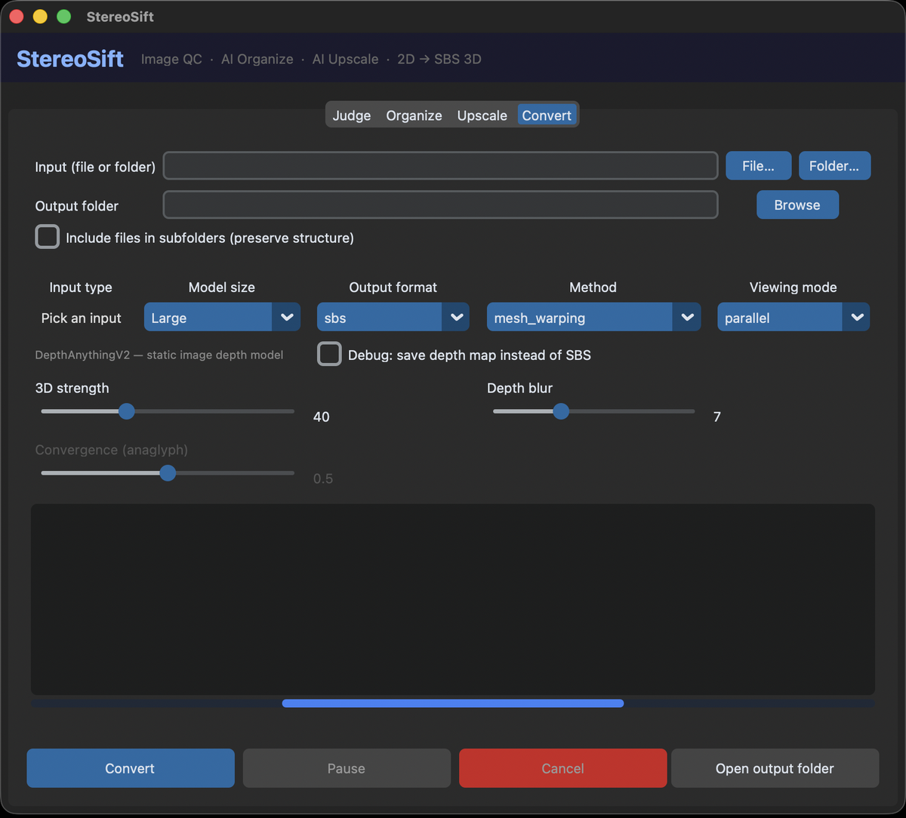

<p align="center">
  
</p>

<h1 align="center">StereoSift</h1>

<p align="center"><strong>Alpha</strong></p>

<p align="center">
  Local desktop toolkit for 2D-to-3D conversion, AI upscaling, image QC, and vision-assisted folder organization.
</p>

<p align="center">
  Offline-first desktop workflow for rendered images, photo batches, archive scans, and AI-assisted image review.
</p>

## Deployment

StereoSift is a local app, so there is no hosted deployment to point at.
You run it from the repo on your machine.

## What It Does

StereoSift bundles a few media-heavy desktop tasks that usually end up spread
across separate scripts and tools:

* 2D image and video to SBS 3D conversion
* AI upscaling for headset-ready or high-resolution exports
* Batch image QC for exposure, structure, and structural artifacts
* Vision-assisted folder organization with your own label set

It is designed for local-first workflows where you want a GUI, repeatability,
and the option to stay fully offline.

## Screenshots

Four tabs, one window. Everything runs on your machine.

| Judge | Organize |
| :-- | :-- |
|  |  |
| Batch QC routes each image to `pass`, `warning`, `fail`, or a review queue. | A vision model picks exactly one of your labels per image. |

| Upscale | Convert |
| :-- | :-- |
|  |  |
| Real-ESRGAN x2plus with tiled inference and aspect-safe target sizes. | Depth-based 2D to SBS 3D, with strength, blur, and convergence controls. |

## Technology Stack

| Technology | Use | Description |
| :-- | :-- | :-- |
| Python | Core language | Main language for the app and scripts |
| PyTorch | Model runtime | Runs the depth and QC models locally |
| CustomTkinter | Desktop UI | GUI for the Convert and Judge tabs |
| Depth Anything V2 | Image depth | Converts 2D images into SBS 3D |
| Video Depth Anything | Video depth | Converts videos frame by frame with temporal consistency |
| Real-ESRGAN x2plus | Image upscaling | Restores detail in tiled x2 passes before an exact target resize |
| YOLO11n | QC subject gate | Detects subjects and flags obvious structural artifacts in the QC flow |
| Moondream2 | QC fallback scan | Checks tricky structural artifacts when the fast checks are not enough |
| LM Studio / oMLX | Optional backend | Local vision backend for stronger QC when you want it |
| requests | HTTP client | Talks to the optional backend |
| Pillow | Image handling | Loads, resizes, and saves images |
| imageio / imageio-ffmpeg | Video I/O | Reads and writes video files |
| opencv-python | Vision helpers | Extra image and video utilities |
| ultralytics | YOLO loader | Loads the YOLO checkpoint |
| transformers | Model loading | Loads Moondream2 from Hugging Face |
| huggingface_hub | Model cache | Handles model downloads and local caching |

## Project Specifications

* Convert 2D images into SBS 3D.
* Convert 2D videos into SBS 3D.
* Keep original audio when converting video.
* Show a GUI for conversion, upscaling, QC, and image organization.
* Sort QC results into `pass`, `warning`, `fail`, and a separate safety-review queue.
* Copy originals by default, and only move files when asked.
* Support a strict offline mode that stays local and skips model-backed checks.
* Optionally connect to a local OpenAI-compatible vision backend if you already have one running.
* Sort images into arbitrary user-defined categories such as `outdoors, indoors`.

## How It Works

StereoSift has four main visible paths.

Convert uses Depth Anything V2 for images and Video Depth Anything for video.
Upscale uses Real-ESRGAN x2plus with tiled inference and aspect-safe sizing for
images and frame-by-frame video upscaling.
Judge has two mutually exclusive paths. By default it sends each image to an
OpenAI-compatible vision backend (LM Studio, oMLX, Ollama) and uses that single
judgment. Clear the backend URL and it falls back to local models instead:
pixel heuristics always, YOLO subject/object detection by default, and an
optional moondream2 deep scan for duplicated or incorrectly joined structures.
Organize asks an OpenAI-compatible vision model to choose exactly one of your
category labels for each image, then copies or moves it into that subfolder.

Strict offline mode forces the local path and additionally turns off YOLO and
the deep scan, leaving pixel-only QC. That is the safest choice if you want no
network-capable behavior at all.

## Example Workflows

* Turn a flat photo or short clip into SBS 3D for headset viewing.
* Upscale a folder of rendered images, product shots, or video clips to a consistent target size.
* Triage AI-generated portraits or character images for obvious structural defects.
* Organize a mixed image dump into labels like `indoors`, `outdoors`, `pets`, or `reference`.

## Project Structure

| File/Folder | Purpose |
| :-- | :-- |
| `gui.py` | CustomTkinter desktop GUI |
| `convert.py` | 2D to SBS 3D conversion CLI |
| `media_utils.py` | Shared image/video detection and collection helpers |
| `qc_pipeline.py` | QC and user-defined image organization pipelines |
| `depth_model.py` | Depth Anything V2 loading |
| `video_converter.py` | Video Depth Anything streaming and encoding |
| `sbs/sbs.py` | SBS warping and conversion helpers |
| `tests/` | Automated tests |
| `models/` | Downloaded checkpoints |
| `video_depth_anything_repo/` | Vendored upstream — Video Depth Anything ([license](THIRD_PARTY_NOTICES.md)) |
| `depth_anything_v2/` | Vendored upstream — Depth Anything V2 ([license](THIRD_PARTY_NOTICES.md)) |

## Installation

Requires Python 3.10+ and FFmpeg (pulled in through `imageio-ffmpeg`).

```bash
python3 -m venv venv
source venv/bin/activate        # Windows: venv\Scripts\activate
python install_torch.py
pip install -r requirements.txt
```

Models download automatically on first use and are stored in `models/`.

If you want a fully offline run, turn on strict offline mode in the Judge tab
or use `--strict-offline` on the CLI.

## Development checks

```bash
pip install -r requirements-dev.txt
python -m pytest -q
python -m compileall -q .
```

## GUI

```bash
python gui.py
```

Visible tabs:

* Judge sorts a folder of images into pass, warning, and fail. It shows scores,
  subject counts, issues, and optional structural notes when the fallback scan is on.
  Recursive input preserves the source subfolder structure under each status.
* Judge also has a strict offline toggle that keeps everything local and blocks
  backend/model-backed checks.
* Organize accepts choices such as `outdoors, indoors` or `places, people`, asks
  your oMLX/LM Studio vision model for the best match, and creates one output
  subfolder per label. It copies by default and can optionally move originals.
  Recursive input preserves the source subfolder structure under each label.
* Upscale runs tiled Real-ESRGAN x2plus on one image/video or a folder. Images
  save as PNG/JPEG; videos are upscaled frame-by-frame, re-encoded, and keep
  audio when possible. Recursive input preserves the source subfolder structure.
* Convert turns 2D images or videos into SBS 3D. It detects whether your chosen
  file/folder contains images, videos, or both and routes each file to the right
  handler. For videos, it keeps the original resolution by default and exposes
  optional max size, depth input size, output FPS, and a first-5-seconds preview
  before committing to a long clip. Recursive input preserves the source
  subfolder structure.

## SBS Conversion

```bash
# Images
python convert.py --input photo.jpg --output-dir output --yes
python convert.py --input ~/Pictures/batch --output-dir output --yes

# Red-cyan anaglyph, or both output formats
python convert.py --input photo.jpg --output-dir output --output-format anaglyph --convergence 0.5 --yes
python convert.py --input photo.jpg --output-dir output --output-format both --yes

# Video
python convert.py --input movie.mp4 --output-dir output --video-encoder vits --yes
python convert.py --input movie.mp4 --output-dir output --video-encoder vits --max-res 720 --video-input-size 392 --yes
python convert.py --input movie.mp4 --output-dir output --video-encoder vits --max-seconds 5 --yes

# Interactive launcher
sh sbs.sh
```

## Image and Video Upscaling

The x2plus checkpoint downloads to `models/` on first use. Aspect ratio is
preserved, media already at the target is not enlarged, and tiled inference
keeps memory use manageable. Video upscaling is much slower than image
upscaling because every frame is processed separately.

```bash
python upscaler.py --input photo.jpg --quest-3-sbs --output-dir output/upscaled
python upscaler.py --input ~/Pictures/batch --long-edge 7680 --output-dir output/8k
python upscaler.py --input clip.mp4 --long-edge 3840 --max-seconds 5 --output-dir output/upscaled
```

Video encoder choices: `vits` is fast, `vitb` is balanced, and `vitl` is the
best quality. Video conversion uses the streaming Video Depth Anything path, so
each frame is depth-estimated, converted to left/right SBS, and written directly
to the output video without loading the whole movie into memory. Video outputs
use a `_SBS_LR` filename suffix to help Quest video players detect left/right
SBS mode; if your player still opens it flat, manually choose SBS/left-right
3D in the player. The GUI keeps the original video resolution by default; use
`--max-res`, `--video-input-size`, `--target-fps`, and `--max-seconds` to trade
quality for speed/memory or make short test previews.
Image model selection follows the same idea through `--model`. Anaglyph output
currently applies to images, and `--convergence` controls where the depth plane
sits when you view red-cyan output.

## Image QC

```bash
# Basic: exposure and contrast checks + YOLO subject/object detection
python qc_pipeline.py --input ~/Pictures/to-review --output-dir output/qc

# With structural scan
python qc_pipeline.py --input ~/Pictures/to-review --output-dir output/qc --deep-scan

# Strictness: relaxed | balanced (default) | strict
python qc_pipeline.py --input ~/Pictures/to-review --output-dir output/qc \
    --deep-scan --strictness strict

# Strict offline mode
python qc_pipeline.py --input ~/Pictures/to-review --output-dir output/qc --strict-offline

# Interactive launcher
sh qc.sh
```

Results go into `pass/`, `warning/`, `fail/`, and `unscored/`.
Originals are copied by default. Use `--move` only if you really want destructive sorting.

Local judgment is intentionally conservative. Only an explicit, confident
structural `PASS` goes into `pass/`. Clear defects, uncertain verdicts,
malformed responses, and scan failures land in `fail/`, which acts as the
manual review queue. Responses where the backend declines to return a verdict, or where scoring
otherwise fails, are routed to `unscored/` so an unrated image is never
confused with an actual structural failure. Exposure and other minor aesthetic issues do not
affect the verdict.

### QC Pipeline Layers

| Layer | Model | What it catches |
| :-- | :-- | :-- |
| Pixel metrics | None | Records exposure and contrast for reference |
| Structure gate | YOLO11n (~6 MB) | Subject presence, object count, and obvious duplicate or fused features |
| Structural scan | moondream2 fallback (~2 GB) | Tricky structural defects when the structure gate is not enough |

YOLO and moondream2 download automatically on first use. The structure gate runs
first on images with subjects, and the moondream2 fallback only kicks in after that
unless you are in strict offline mode.

Strict offline mode disables those model-backed checks entirely, so the QC path
stays local to image decoding and pixel heuristics only.

### Experimental Qwen Benchmark

`qwen_structure.py` is WIP/reference-only benchmark code. It is intentionally
inert in the app unless someone runs or imports it directly, and it is not part
of the GUI, converter, or production routing policy. It can run either against a
local Qwen-VL checkpoint in the Hugging Face cache or against an
OpenAI-compatible vision backend such as oMLX. For the local offline path, once
the default
`Qwen/Qwen3-VL-4B-Instruct` checkpoint is present in the Hugging Face cache,
benchmark a labeled folder fully offline with:

```bash
python tools/benchmark_structure.py \
  --input path/to/images \
  --labels path/to/labels.json \
  --output output/qwen-benchmark.json
```

The label file is a JSON object mapping each filename to `pass` or `fail`.
The report includes latency, errors, accuracy, and fail precision/recall so a
model that misses defects is not hidden behind headline accuracy.

### Optional Backend

If you already have a local vision model running in LM Studio or oMLX, you can
point the Judge tab at it.

* LM Studio: `http://127.0.0.1:1234/v1`
* oMLX: `http://127.0.0.1:8001/v1` (matches the app's default; use whatever port your server reports)

The full `/v1/chat/completions` URL is also accepted. If authentication is on,
paste the Bearer token into the API key field or pass it with `--api-key`.

The standalone Qwen judge also accepts the same backend URL pattern,
which makes it easy to benchmark the exact vision model you have loaded in
oMLX.

```bash
python qc_pipeline.py \
  --input ~/Pictures/to-review \
  --output-dir output/qc \
  --backend-url http://127.0.0.1:8000/v1 \
  --model Qwen3.6-35B-A3B-MLX-4bit
```

That path replaces the local fallback scan with a standard multimodal
OpenAI-compatible request. Images are resized to at most 1536 px and sent
inline over localhost.

## License

StereoSift uses and incorporates third-party software, source code,
architectures, and model checkpoints. See
[THIRD_PARTY_NOTICES.md](THIRD_PARTY_NOTICES.md) for the attribution,
upstream links, license information, and the specific role of each component.

Model licenses may differ from the licenses of their implementation code.
Check the exact checkpoint license before redistribution or commercial use.
